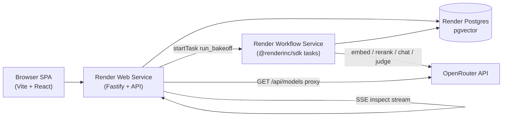

# RAGtime

RAGtime is an open-source template that answers one question: **which combination of embedding, rerank, and generation models should power your RAG app?** Load a corpus and golden questions, pick a matrix of model combinations, and a Render Workflow fans out across every combo x question pair, scores answers with an LLM-as-judge, and produces a cost / latency / quality leaderboard.


## Highlights

- **One OpenRouter key** for embeddings, rerank, chat, and judging with per-stage cost receipts
- **Render Workflows fan-out**: hundreds of parallel trial tasks with automatic retries
- **Resumable stages**: `trials.stages` jsonb skips completed work on retry (no double billing)
- **Budget guard**: atomic per-run spend ceiling (`MAX_RUN_BUDGET_USD`)
- **Live catalog**: model pickers from `GET /models`, no hardcoded slugs in app code
- **Query inspector**: single-query SSE pipeline view using the same stage functions as the arena
- **Ports and adapters**: swap OpenRouter, pgvector, or the judge in two `wiring.ts` files
- **`MODEL_GATEWAY=fake`**: zero-spend end-to-end demos and CI

## Architecture



| Component | Render service | Role |
|-----------|----------------|------|
| Dashboard + API | Web Service | SPA, run creation, polling, models proxy, query inspector |
| Trial pipeline | Workflow Service | Ingest, embed, retrieve, rerank, generate, judge |
| Vectors + state | Postgres 16 + pgvector | Chunks, embeddings, runs, trials, run events |

Pure pipeline stages live in `packages/core/pipeline/`. Workflow tasks and the inspector call those functions through wired ports (`apps/web/src/server/wiring.ts`, `apps/workflows/src/wiring.ts`).

## Deploy on Render

### 1. Fork and connect

Fork this repo, then create a **Blueprint** from `render.yaml` (web service + Postgres).

### 2. Create the Workflow service (manual)

Render Blueprints do not yet support Workflow services. In the Dashboard:

1. **New > Workflow**
2. Connect the same repo
3. **Root Directory**: leave empty (repo root; required for pnpm workspace packages)
4. **Build Command**: `pnpm install && pnpm build:workflows` (builds workspace deps + workflows)
5. **Start Command**: `node apps/workflows/dist/index.js`
6. **Region**: same as web + database (private networking)
7. Note the **Workflow Slug** (e.g. `ragtime-workflows`) and set `WORKFLOW_SLUG` on the web service to match

### 3. Set secrets (two required)

| Variable | Service | Purpose |
|----------|---------|---------|
| `OPENROUTER_API_KEY` | Web + Workflow | All model calls (web: models proxy only) |
| `RENDER_API_KEY` | Web only | Trigger and cancel workflow tasks |

Also set on **Web** (Blueprint auto-wires the rest):

- `WORKFLOW_SLUG`: must match Dashboard slug (`ragtime-workflows` in `render.yaml`)

Set on **Workflow** (manual; Blueprints do not support Workflow services yet):

- `DATABASE_URL`: link from `ragtime-db` (internal URL)
- `OPENROUTER_API_KEY`
- `APP_URL`: set to the web service public URL (e.g. `https://ragtime-web.onrender.com`) for OpenRouter `HTTP-Referer`

Optional: `MODEL_GATEWAY=fake` on both services for a zero-spend smoke deploy (no OpenRouter key needed).

### 4. Seed demo data

From your machine or a one-off shell with `DATABASE_URL`:

```bash
pnpm install
pnpm db:migrate
pnpm seed
pnpm suggest-matrix   # requires OPENROUTER_API_KEY; prints a starter model matrix
```

Run `pnpm seed` twice to confirm idempotency.

### 5. Launch

Open the web URL, open the **SciFact (BEIR)** corpus, configure a small matrix, and click **Launch bake-off**. Use **Inspect a single query** to watch embed, retrieve, rerank, generate, and judge stage by stage.

## Local development

**Prerequisites**: Node 20+, pnpm 9+, Docker (pgvector), Render CLI 2.11+

```bash
cp .env.example .env
# OPENROUTER_API_KEY for real models, or MODEL_GATEWAY=fake for offline

docker compose up -d
pnpm install
pnpm db:migrate
pnpm seed
pnpm dev
```

- SPA: http://localhost:5173
- API: http://localhost:3000
- Workflow dev server: `render workflows dev -- pnpm --filter @ragtime/workflows dev`

For local task triggers from the web service:

```bash
export RENDER_API_URL=http://localhost:8090
```

### Smoke tests

```bash
pnpm smoke:fake          # always works, zero spend
pnpm smoke               # OpenRouter when OPENROUTER_API_KEY is set, then fake
```

Prints embed, rerank (if `SMOKE_RERANK_MODEL` set), and chat receipts.

## Demo script

1. `pnpm seed` loads **SciFact (BEIR)** (100 PubMed abstracts from the [BEIR SciFact benchmark](https://huggingface.co/datasets/BeIR/scifact) plus 12 gold test claims and one unanswerable claim). Also seeds legacy **Pigeon docs** for offline smoke tests.
2. Set `MODEL_GATEWAY=fake` locally or use a small real matrix from `pnpm suggest-matrix`.
3. Launch a small bake-off: 2 embedding x (none + 1 rerank) x 2 chat models x 12 questions.
4. Open `/run/:id`: narrate the phase strip (document ingest, per-model embedding bars), the trial grid filling in, and the **activity feed** (embedding batches, trial stages, retries).
5. Open `/corpus/:id/inspect`, run a query with rerank on and off, and compare chunk ordering and answers.
6. Set `CHAOS_FAILURE_RATE=0.15` on the workflow service, redeploy, launch again: watch failed cells retry and recover in the feed.
7. Kill a running task from the Render Dashboard mid-run: run still converges; `attempts > 1` without duplicate stage receipts.
8. Open trial drill-down: rerank before/after ordering, judge scores, per-stage receipts (`n/a` when cost is unknown).
9. For the unanswerable cosmic-radiation claim: faithful models decline; hallucinating models score low.

Regenerate the SciFact JSON from upstream BEIR data:

```bash
pnpm --filter @ragtime/db build:scifact-seed
```

## Cost expectations

A suggested-matrix smoke run with budget-tier models typically lands in **low single-digit USD**, always bounded by `MAX_RUN_BUDGET_USD` (default $5). Compare summed stage costs to your [OpenRouter activity dashboard](https://openrouter.ai/activity) for the run window (expect within ~10%).

## How it works

**Ingest**: URL or upload text is chunked (~800 tokens, 15% overlap) into Postgres.

**Embed**: For each embedding model in the matrix, missing chunk embeddings are batched (`EMBED_BATCH_SIZE`) and stored in pgvector (untyped `vector` + `dims` sidecar).

**Retrieve**: Query embedding cached per `(run, question, model)`; cosine top-`retrieve_k` with `WHERE embedding_model = $model`.

**Rerank**: Optional OpenRouter rerank down to `final_k` with optional relevance threshold.

**Generate**: Context blocks with `[chunk:N]` citation instructions.

**Judge**: Fixed judge model scores faithfulness, correctness, completeness (0 to 10); weighted `overall_score`.

**Aggregate**: Checksum `total_cost_usd` from stage receipts.

## Swapping a module

Ports are defined in `packages/core/src/ports.ts`. Adapters are wired only in:

- `apps/web/src/server/wiring.ts`
- `apps/workflows/src/wiring.ts`

### Replace OpenRouter with another gateway

1. Add `packages/gateway-acme/` implementing `ModelGateway` (`chat`, `embed`, `rerank`, `catalog`).
2. Import it in both `wiring.ts` files and branch on `MODEL_GATEWAY=acme`.
3. Set `MODEL_GATEWAY=acme` in Render env vars.

No changes to `packages/core`, workflow tasks, or UI.

### Other swaps

| Port | Default | Fork action |
|------|---------|-------------|
| `VectorStore` | `createPgVectorStore` in `packages/db` | New adapter package + one line in both `wiring.ts` |
| `Extractor` | `html-to-text` | Replace `extractor` in `wiring.ts` |
| `Chunker` | LangChain recursive splitter | Replace `chunker` in `wiring.ts` |
| `Scorer` | Rubric pointwise judge | Replace `scorer` in `wiring.ts` |

Use `packages/gateway-fake` as a reference for deterministic, zero-cost behavior.

## Configuration

| Variable | Default | Description |
|----------|---------|-------------|
| `DATABASE_URL` | (required) | Postgres with pgvector |
| `OPENROUTER_API_KEY` | (required for real models) | OpenRouter bearer token |
| `RENDER_API_KEY` | (required on web) | Render API key for workflow triggers |
| `APP_URL` | `http://localhost:5173` | Public URL for OpenRouter attribution |
| `OPENROUTER_APP_TITLE` | `RAGtime` | `X-OpenRouter-Title` header |
| `MODEL_GATEWAY` | `openrouter` | `fake` for zero-spend offline/CI |
| `WORKFLOW_SLUG` | `ragtime-workflows` | `{slug}/{task_name}` prefix |
| `JUDGE_MODEL` | (from run config) | Default judge if not set per run |
| `MAX_RUN_BUDGET_USD` | `5` | Hard per-run ceiling |
| `EMBED_BATCH_SIZE` | `64` | Texts per embeddings API call |
| `CHAOS_FAILURE_RATE` | `0` | Probability of pre-spend task failure (0 to 1) |

## Project structure

```
ragtime/
  apps/web/                 Fastify API + Vite React SPA
  apps/workflows/           Render Workflow tasks
  packages/core/            Ports, pipeline stages, prompts, schemas
  packages/db/              Drizzle schema, migrations, seed, PgVectorStore
  packages/gateway-openrouter/  OpenRouter ModelGateway adapter
  packages/gateway-fake/    Deterministic zero-spend gateway for CI/demos
  render.yaml               Blueprint (web + Postgres)
```

## License

MIT
